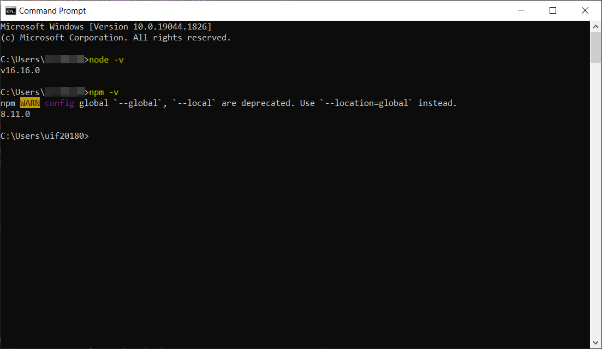

# Getting Started with Create React App

This project was bootstrapped with [Create React App](https://github.com/facebook/create-react-app).

## Requirements

1. NodeJS
2. NPM

## Installation of NodeJS and NPM

1. Download the installler from [NodeJS website](https://nodejs.org/en/).
2. Run the installer.
3. Restart your system for installation to take effect
4. Check installation with the following commands:
   ```
   $ node -v
   ```
   ```
   $ npm -v
   ```
   
   You are done with the installation.

## Installing the project dependencies

1. Navigate to project root after cloning repository
   ```
   $ cd conti-hmc-client
   ```
2. In the [package.json](./package.json), all required packages are stated under the dependencies object

   ```
   {
      "name": "reactjs-conti-hmc",
      "version": "0.1.0",
      "private": true,
      "proxy": "http://localhost:3001/",
      "homepage": "http://www.hmc-react-app.com",
      "dependencies": {
         "@emotion/react": "^11.9.3",
         "@emotion/styled": "^11.9.3",
         "@fontsource/roboto": "^4.5.7",
         "@mui/icons-material": "^5.8.4",
         "@mui/material": "^5.9.0",
         "@mui/system": "^5.9.0",
         "@testing-library/jest-dom": "^5.16.4",
         "@testing-library/react": "^13.3.0",
         "@testing-library/user-event": "^13.5.0",
         "@twilio/voice-sdk": "^2.0.1",
         "axios": "^0.27.2",
         "nanoid": "^4.0.0",
         "notistack": "^2.0.5",
         "react": "^18.2.0",
         "react-dom": "^18.2.0",
         "react-player": "^2.10.1",
         "react-scripts": "5.0.1",
         "react-window": "^1.8.7",
         "util": "^0.12.4",
         "web-vitals": "^2.1.4"
      },
      "scripts": {
         "start": "react-scripts start",
         "build": "react-scripts build",
         "test": "react-scripts test",
         "eject": "react-scripts eject"
      },
      ...
   }
   ```

   To install dependencies, run the following command in the project root

   ```
   $ npm install
   ```

## Develop, build, deploy

To run the project in development mode

```
$ npm start
```

To build project for deployment

```
$ npm run build
```

To deploy to locally, for environments using Node, the easiest way to handle this would be to install serve and let it handle the rest:

```
$ npm install -g serve
$ serve -s build
```

The last command shown above will serve your static site on the port 3000. Like many of serve’s internal settings, the port can be adjusted using the -l or --listen flags:

```
serve -s build -l 4000
```

Run this command to get a full list of the options available:

```
serve -h
```

To deploy on **XAMPP**, follow this [guide](https://medium.com/@nutanbhogendrasharma/create-simple-reactjs-application-and-host-in-xampp-4dae8e466c50)

## Available Scripts

In the project directory, you can run:

### `npm start`

Runs the app in the development mode.\
Open [http://localhost:3000](http://localhost:3000) to view it in your browser.

The page will reload when you make changes.\
You may also see any lint errors in the console.

### `npm test`

Launches the test runner in the interactive watch mode.\
See the section about [running tests](https://facebook.github.io/create-react-app/docs/running-tests) for more information.

### `npm run build`

Builds the app for production to the `build` folder.\
It correctly bundles React in production mode and optimizes the build for the best performance.

The build is minified and the filenames include the hashes.\
Your app is ready to be deployed!

See the section about [deployment](https://facebook.github.io/create-react-app/docs/deployment) for more information.

### `npm run eject`

**Note: this is a one-way operation. Once you `eject`, you can't go back!**

If you aren't satisfied with the build tool and configuration choices, you can `eject` at any time. This command will remove the single build dependency from your project.

Instead, it will copy all the configuration files and the transitive dependencies (webpack, Babel, ESLint, etc) right into your project so you have full control over them. All of the commands except `eject` will still work, but they will point to the copied scripts so you can tweak them. At this point you're on your own.

You don't have to ever use `eject`. The curated feature set is suitable for small and middle deployments, and you shouldn't feel obligated to use this feature. However we understand that this tool wouldn't be useful if you couldn't customize it when you are ready for it.

## Learn More

You can learn more in the [Create React App documentation](https://facebook.github.io/create-react-app/docs/getting-started).

To learn React, check out the [React documentation](https://reactjs.org/).

### Code Splitting

This section has moved here: [https://facebook.github.io/create-react-app/docs/code-splitting](https://facebook.github.io/create-react-app/docs/code-splitting)

### Analyzing the Bundle Size

This section has moved here: [https://facebook.github.io/create-react-app/docs/analyzing-the-bundle-size](https://facebook.github.io/create-react-app/docs/analyzing-the-bundle-size)

### Making a Progressive Web App

This section has moved here: [https://facebook.github.io/create-react-app/docs/making-a-progressive-web-app](https://facebook.github.io/create-react-app/docs/making-a-progressive-web-app)

### Advanced Configuration

This section has moved here: [https://facebook.github.io/create-react-app/docs/advanced-configuration](https://facebook.github.io/create-react-app/docs/advanced-configuration)

### Deployment

This section has moved here: [https://facebook.github.io/create-react-app/docs/deployment](https://facebook.github.io/create-react-app/docs/deployment)

### `npm run build` fails to minify

This section has moved here: [https://facebook.github.io/create-react-app/docs/troubleshooting#npm-run-build-fails-to-minify](https://facebook.github.io/create-react-app/docs/troubleshooting#npm-run-build-fails-to-minify)
